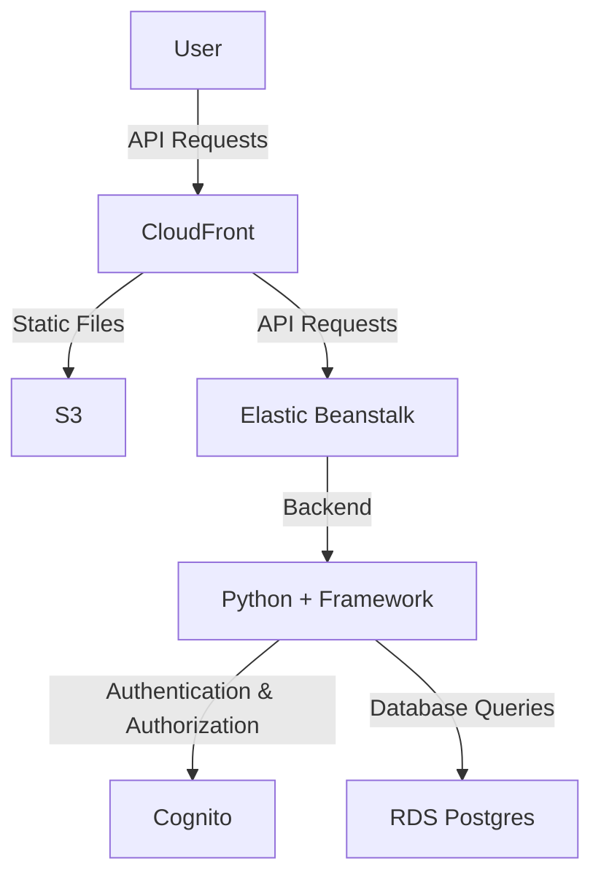

# Architecture Diagram

```mermaid
graph TD
    A[User] -- API Requests --> B[CloudFront]
    B -- Static Files --> C[S3]
    B -- API Requests --> D[Elastic Beanstalk]
    D -- Backend --> E[Python + Framework]
    E -- Authentication & Authorization --> F[Cognito]
    E -- Database Queries --> G[RDS Postgres]
```
