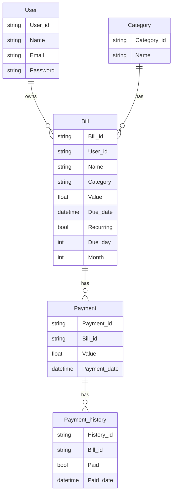

### ER Diagram

```mermaid
erDiagram
    User {
        string User_id
        string Name
        string Email
        string Password
    }

    Bill {
        string Bill_id
        string User_id
        string Name
        string Category
        float Value
        datetime Due_date
        bool Recurring
        int Due_day
        int Month
    }

    Payment {
        string Payment_id
        string Bill_id
        float Value
        datetime Payment_date
    }

    Payment_history {
        string History_id
        string Bill_id
        bool Paid
        datetime Paid_date
    }

    Category {
        string Category_id
        string Name
    }

    User ||--o{ Bill : owns
    Category ||--o{ Bill : has
    Bill ||--o{ Payment : has
    Payment ||--o{ Payment_history : has

```
